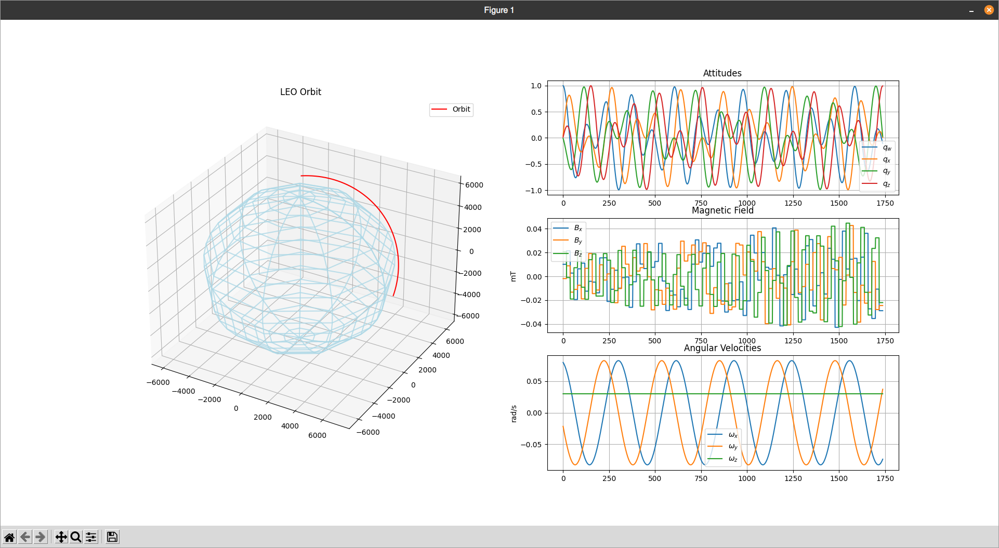

# Satellite Simulation
This project started as an experimental, line-by-line Python port of the MATLAB Simulation 
by Carlos Montalvo in his ADCS Seminar for LEO Satellites, available on his [YouTube Channel](https://www.youtube.com/c/CarlosMontalvo251/)

But as time passed, I started making more and more changes to the code structure and now I'm attempting to turn this
into a useful tool in the development of @zenitheesc CubeSats ADCS subsystems. 

[Link to the Original MATLAB](https://github.com/cmontalvo251/MATLAB/tree/master/ADCS_Seminar_Series)

## Roadmap
 - Implement Models and Integration in C++ for better performance
 - Visualize Attitude in a 3D environment
 - Create a better overall data visualization, either a dedicated tool or using [ZenView](https://github.com/zenitheesc/ZenView)
 
## Reference:
 Carlos Montalvo (2021). Montalvo Models, Simulations and Scripts (https://github.com/cmontalvo251/MATLAB), GitHub. Retrieved July 11, 2021. 
